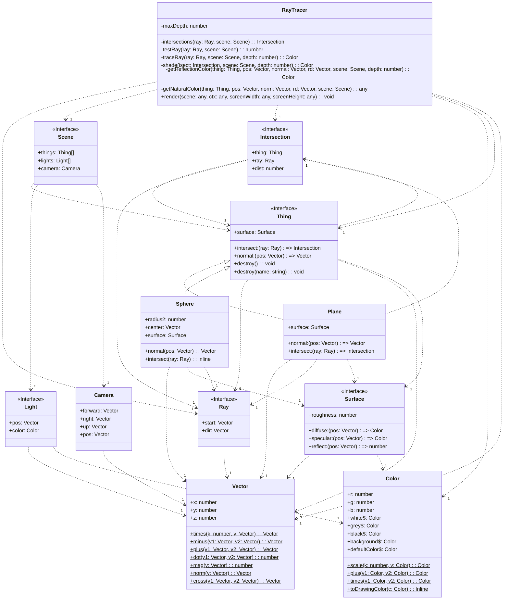

# artboard

svelte-kit playground

[](https://choosealicense.com/licenses/mit/)
[](https://github.com/GaryB432/artboard/actions/workflows/ci.yml)

On line at https://artboard-nu.vercel.app and at https://artboard.nabors-place.com

## Run locally

```bash
npm install
npm run build
npm run test
npm run lint
```

or

```bash
nx build
nx test
nx lint
nx dev
```

## Features

- [@gb-nx/svelte - svelte-kit NX plugin](https://www.npmjs.com/package/@gb-nx/svelte)
- [SvelteKit • Web development, streamlined](https://kit.svelte.dev/)
- [Nx: Smart, Fast and Extensible Build System](https://nx.dev/)
- Request animation frame
- [ai/easings.net: Easing Functions Cheat Sheet](https://github.com/ai/easings.net)

## Roadmap

- ~~move to nx~~

- fix buzzing sound

## Related

### Scalable Vector Graphics

[DOM Interfaces](https://www.w3.org/TR/SVG11/animate.html#DOMInterfaces)

[w3c animate](https://www.w3.org/TR/SVG11/animate.html)

[SVG Attribute reference](https://developer.mozilla.org/en-US/docs/Web/SVG/Attribute)

### elements

[shadow parts](https://css-tricks.com/styling-in-the-shadow-dom-with-css-shadow-parts/)

### tplant

[tplant/test/Playground/RayTracer at 67ceef69e2f9027270a022b985b24cee636dab25 · bafolts/tplant](https://github.com/bafolts/tplant/tree/67ceef69e2f9027270a022b985b24cee636dab25/test/Playground/RayTracer)

[tplant/test/Playground/RayTracer at 67ceef69e2f9027270a022b985b24cee636dab25 · bafolts/tplant](https://github.com/bafolts/tplant/tree/67ceef69e2f9027270a022b985b24cee636dab25/test/Playground/RayTracer)

[tplant/test/mermaid/results/playground_raytracer at 67ceef69e2f9027270a022b985b24cee636dab25 · bafolts/tplant](https://github.com/bafolts/tplant/blob/67ceef69e2f9027270a022b985b24cee636dab25/test/mermaid/results/playground_raytracer)


