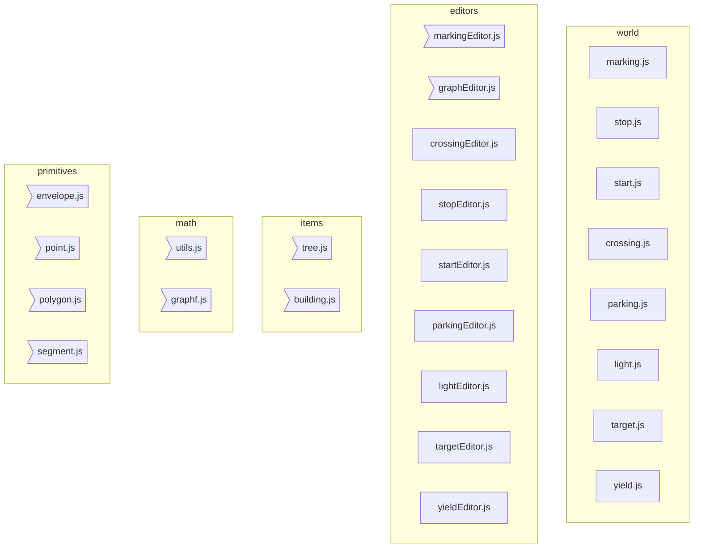

# RADU MARIESCU ISTODOR

[Radu From Finland](https://radufromfinland.com/#about)

[gniziemazity/virtual-world](https://github.com/gniziemazity/virtual-world)

```pre
│   car.js
│   car.png
│   controls.js
│   index.html
│   main.js
│   miniMap.js
│   network.js
│   sensor.js
│   style.css
│   utils.js
│   visualizer.js
│
└───world
    │   car.png
    │   index.html
    │   styles.css
    │
    ├───js
    │   │   viewport.js
    │   │   world.js
    │   │
    │   ├───editors
    │   │       crossingEditor.js
    │   │       graphEditor.js
    │   │       lightEditor.js
    │   │       markingEditor.js
    │   │       parkingEditor.js
    │   │       startEditor.js
    │   │       stopEditor.js
    │   │       targetEditor.js
    │   │       yieldEditor.js
    │   │
    │   ├───items
    │   │       building.js
    │   │       tree.js
    │   │
    │   ├───markings
    │   │       crossing.js
    │   │       light.js
    │   │       marking.js
    │   │       parking.js
    │   │       start.js
    │   │       stop.js
    │   │       target.js
    │   │       yield.js
    │   │
    │   ├───math
    │   │       graph.js
    │   │       osm.js
    │   │       utils.js
    │   │
    │   └───primitives
    │           envelope.js
    │           point.js
    │           polygon.js
    │           segment.js
    │
    └───saves
            big.world
```



```
D:\\RADU
│   viewport.ts
│   world.ts
│
└───world
    ├───editors
    |       markingEditor.ts
    │       graphEditor.ts
    │
    ├───items
    │       building.ts
    │       tree.ts
    │
    ├───math
    │       graph.ts
    │       utils.ts
    │
    └───primitives
            envelope.ts
            point.ts
            polygon.ts
            segment.ts
```
